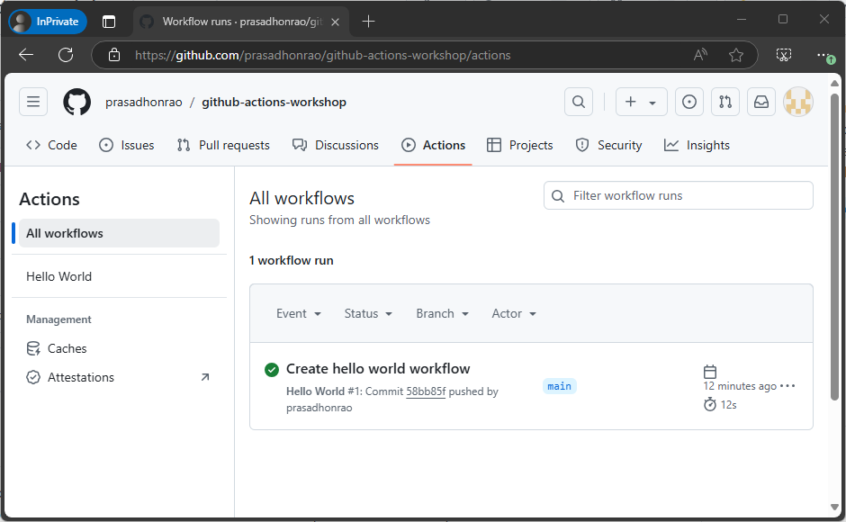
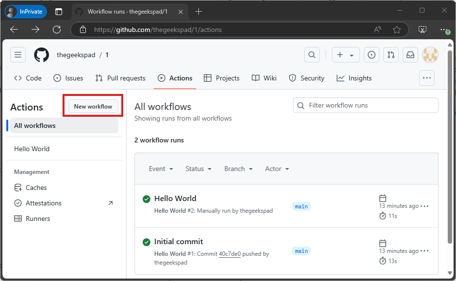
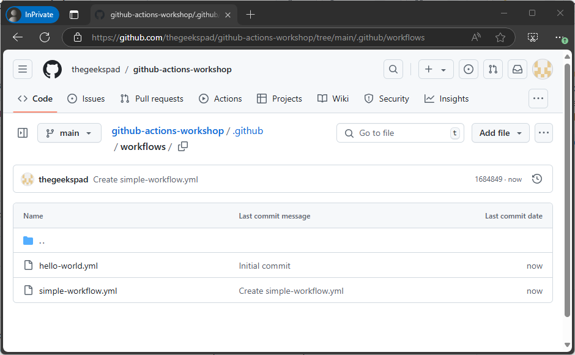
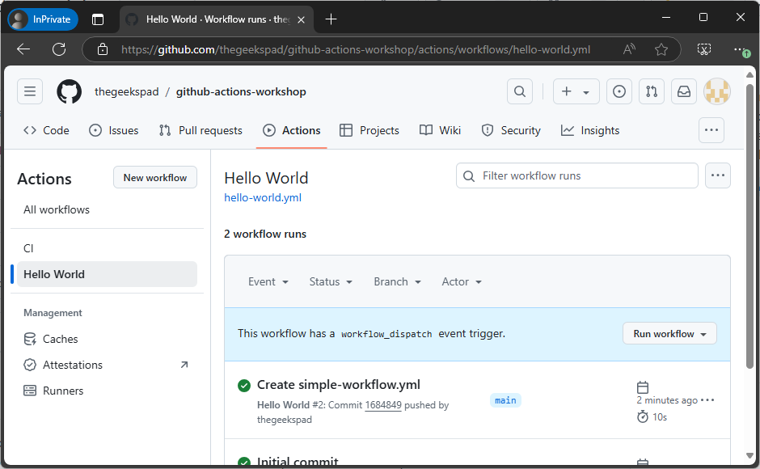

# Create Simple Workflow

In this lab, you will create a simple workflow that runs on every push to the repository. The workflow will echo a message to the console.

> Duration: 10-15 minutes

## 2.1 Create a new workflow

1. Navigate to the repository you created in the previous lab.

   

2. Navigate to `Actions` tab.

   

3. Click on the `New workflow` button.

   

4. Select `Simple workflow` template and click on `Configure` button

   

5. Enter the workflow name as `simple-workflow.yml` and click on `Commit changes...` button

   

6. This will create a new file `.github/workflows/simple-workflow.yml` in your repository

   

7. Navigate to Actions tab and you will see the workflow in the list.

   

8. Click on `Run workflow` button and select `main` branch and click on `Run workflow` button

   
