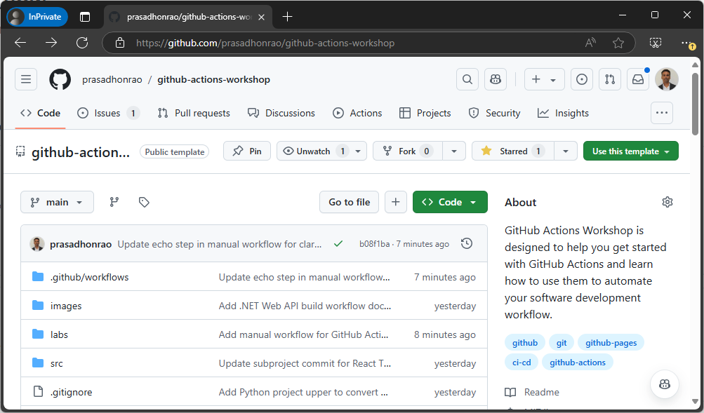
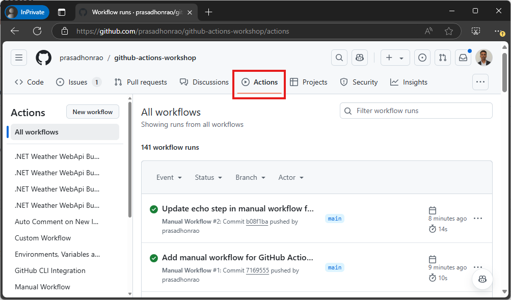
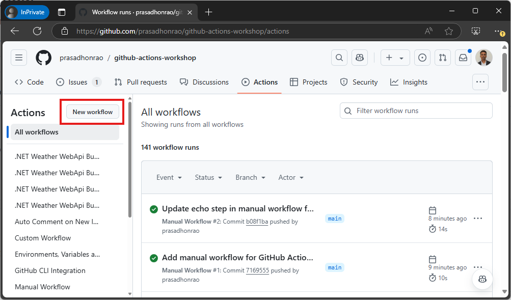
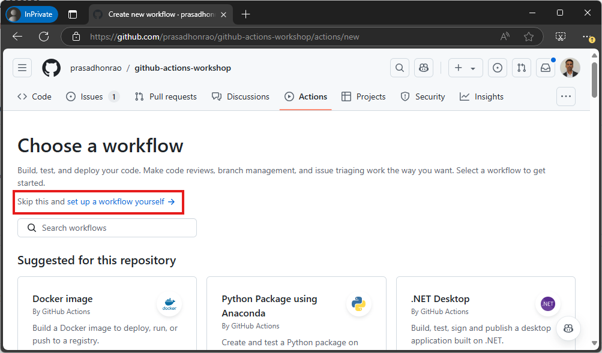
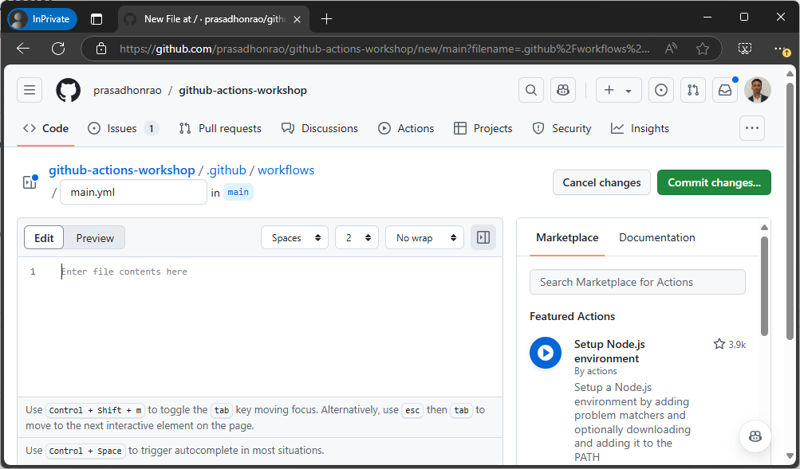
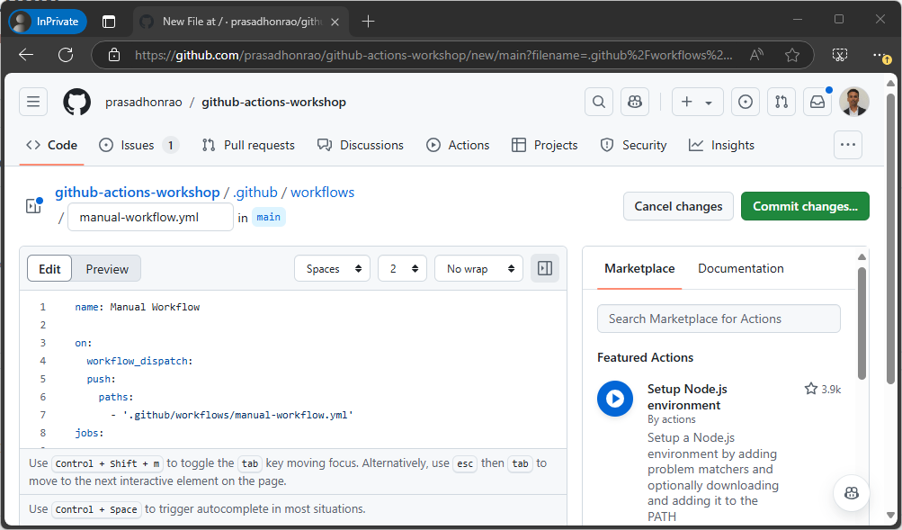
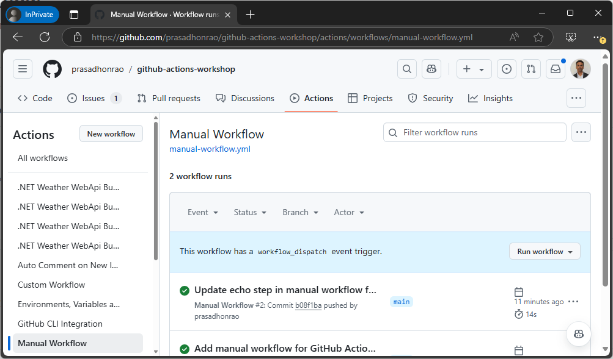
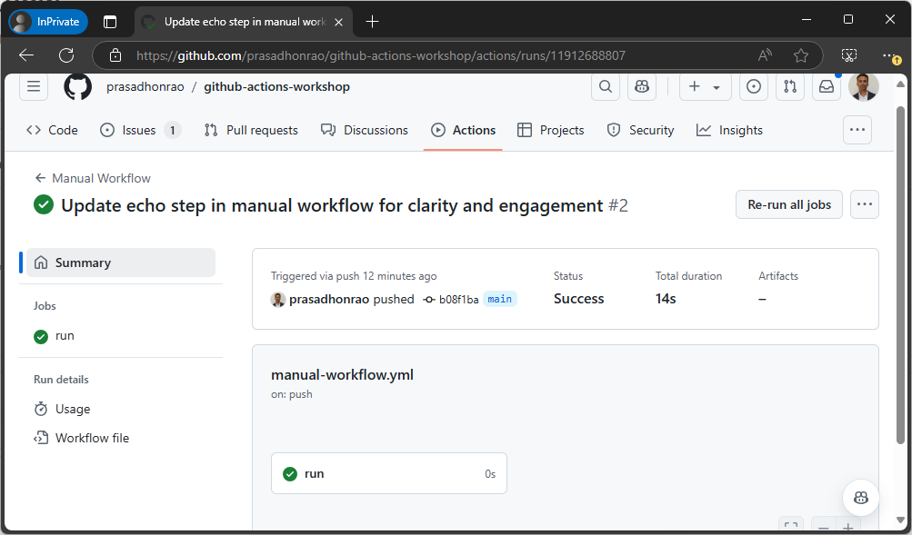
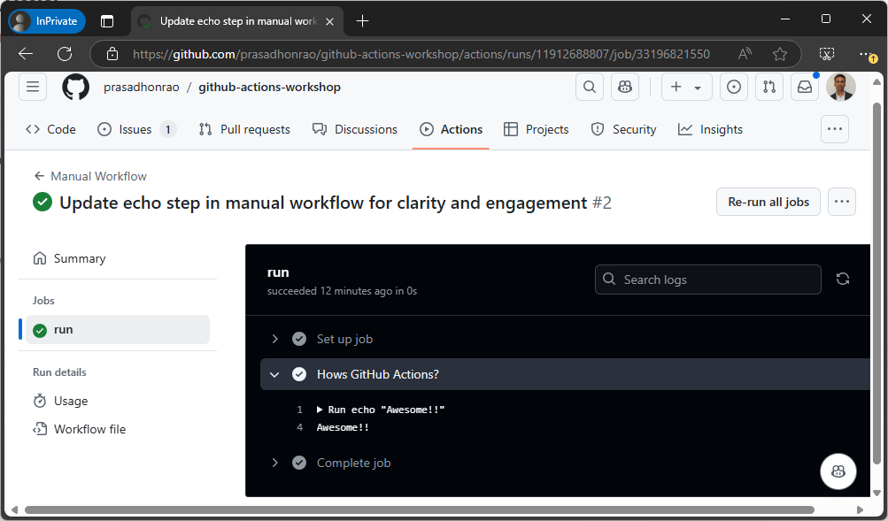

# Manual Workflow

## Introduction

In this lab you will create a manual workflow that runs on a manual trigger. The workflow will echo a message to the console.

> Duration: 10-15 minutes

## Instructions

1. Navigate to the repository you created in the previous lab.

   

2. Navigate to `Actions` tab.

   

3. Click on the `New workflow` button.

   

4. Select `Manual workflow` template and click on `Configure` button

   

5. This will open GitHub Action's workflow editor.

   

6. Enter the workflow name as `manual-workflow.yml` and add following content in the editor and click on `Commit changes` button.

   ```YAML
   name: Manual Workflow
   on:
    workflow_dispatch:
    push:
      paths:
      - '.github/workflows/manual-workflow.yml'
    jobs:
      run:
        runs-on: ubuntu-latest
        steps:
          - name: Hows GitHub Actions?
            run: echo "Awesome!!"
   ```

   

7. This will create a new file `.github/workflows/manual-workflow.yml` in your repository. Navigate to Actions tab and you will see the workflow in the list. Click on `Run workflow` button and select `main` branch and click on `Run workflow` button. This will trigger the workflow and you will see the workflow running.

   

8. Click on the workflow run to see the details of the workflow run.

   

9. Click on the job to see the details of the job.

   

## Solution

<details>
  <summary>manual-workflow.yml</summary>
  
```YAML
name: Manual Workflow
on:
  workflow_dispatch:
  push:
    paths:
      - '.github/workflows/manual-workflow.yml'
jobs:
  run:
    runs-on: ubuntu-latest
    steps:
      - name: Hows GitHub Actions?
        run: echo "Awesome!!"
```

</details>

## Conclusion

In this lab, you created a manual workflow that runs on a manual trigger. The workflow echoed a message to the console.

## Additional Resources

1. [GitHub Actions Documentation](https://docs.github.com/en/actions)
