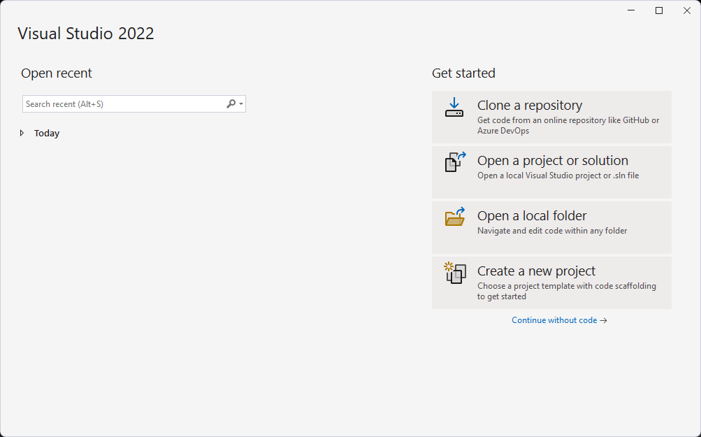
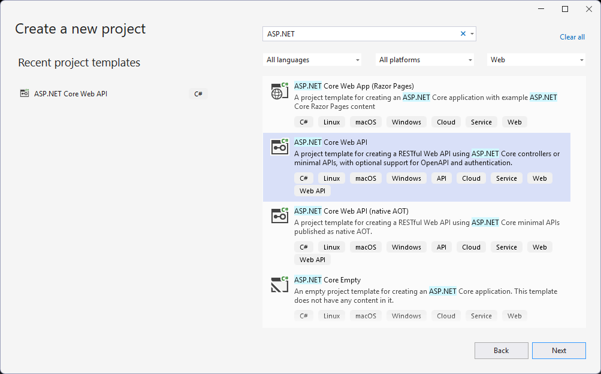
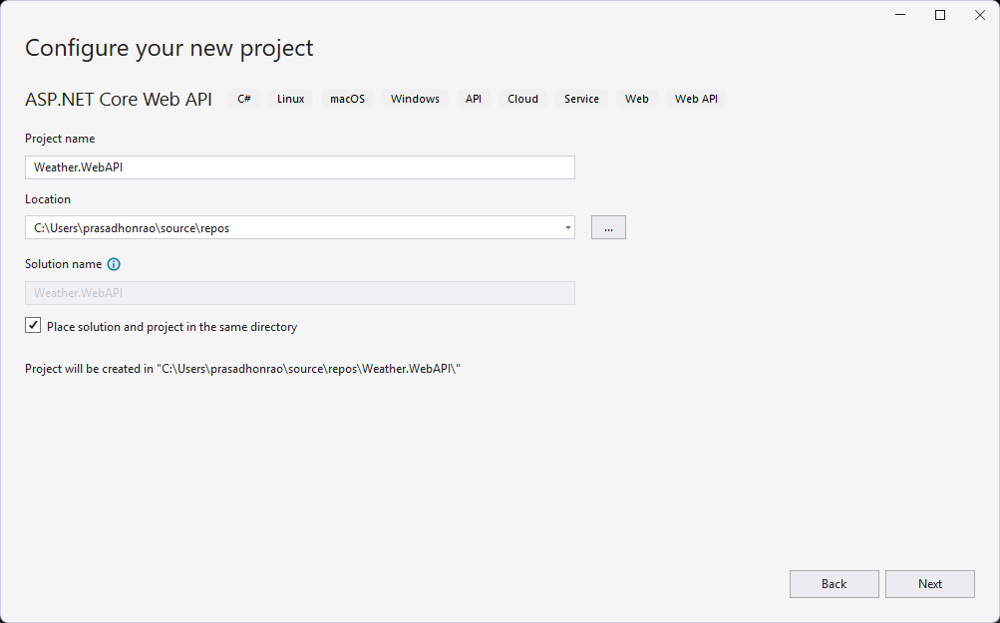
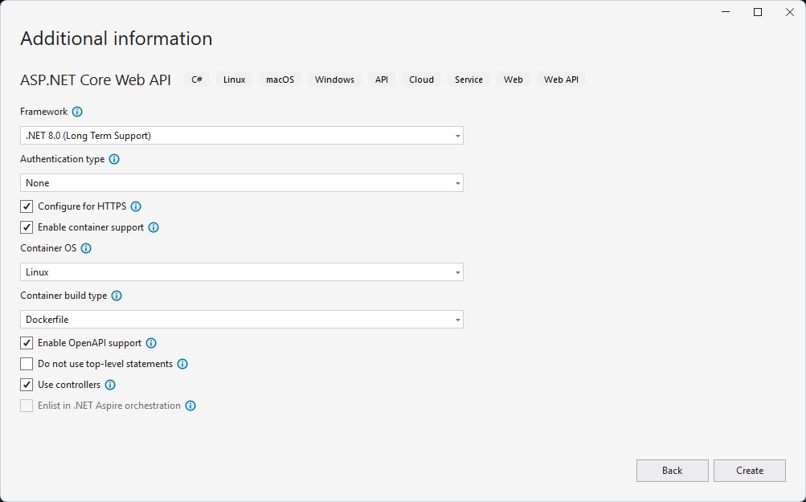
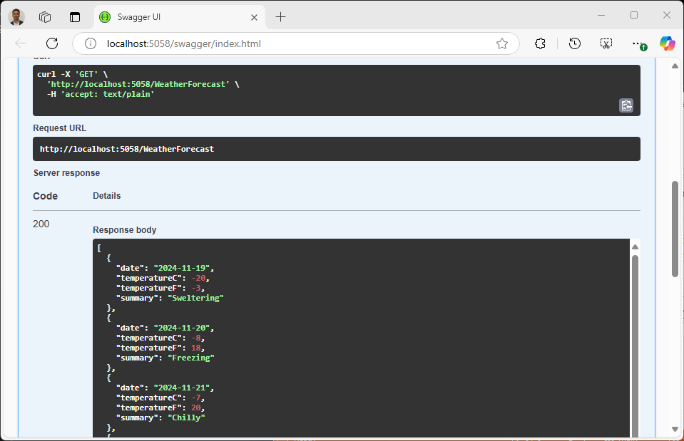

# .NET Web API Build Workflow

In this lab, you will create a workflow to build ASP.NET Core Web API project using GitHub Actions.

> Duration: 20-30 minutes

## 3.1 Create ASP.NET Core Web API project

1. Launch Visual Studio and select `Create a new project` option.



2. Search for `ASP.NET` template and select `ASP.NET Core Web API` template.



3. Enter the project name as `Weather.WebAPI` and click on `Next` button.



4. Provide additional information as shown below and click on `Create` button.



5. The project will be created and displayed in Visual Studio.


6. Run the project by clicking on the `http` button.


7. The project will be launched in the browser.


8. Test the API using the Swagger UI and verify the response.



## 3.2 Create GitHub Actions Workflow

1. Open the workflow file [dotnet-weather-webapi-build.yml](/.github/workflows/dotnet-weather-webapi-build.yml) and copy the following YAML content in `jobs` section

```YAML
  build:
    name: build
    runs-on: ubuntu-latest
    steps:
      - uses: actions/checkout@v4
      - run: dotnet --list-runtimes
      - run: dotnet --list-sdks
      - run: dotnet build
        working-directory: ./src/dotnet/Weather.WebApi
```

10. Commit the changes into the `main` branch
11. Go to `Actions` and manually trigger the workflow by clicking on `Run Workflow` button
12. See the details of your running workflow

## 3.2 Run the Workflow with Windows Runner

1. Open the workflow file [dotnet-weather-webapi-build-windows-runner.yml](/.github/workflows/dotnet-weather-webapi-windows-runner.yml) and note that the runner is `windows-latest`

```YAML
  build:
    name: build
    runs-on: windows-latest
    steps:
      - uses: actions/checkout@v4
      - run: dotnet --list-runtimes
      - run: dotnet --list-sdks
      - run: dotnet build
        working-directory: ./src/dotnet/Weather.WebApi
```

2. Go to `Actions` and manually trigger the workflow `.NET Weather WebApi Build with Windows Runner` by clicking on `Run Workflow` button
3. See the details of your running workflow

## 3.3 Run the Workflow with Mac Runner

1. Open the workflow file [dotnet-weather-webapi-build-mac-runner.yml](/.github/workflows/dotnet-weather-webapi-mac-runner.yml) and note that the runner is `macos-latest`

```YAML
  build:
    name: build
    runs-on: macos-latest
    steps:
      - uses: actions/checkout@v4
      - run: dotnet --list-runtimes
      - run: dotnet --list-sdks
      - run: dotnet build
        working-directory: ./src/dotnet/Weather.WebApi
```

2. Go to `Actions` and manually trigger the workflow `.NET Weather WebApi Build with Mac Runner` by clicking on `Run Workflow` button
3. See the details of your running workflow

## 3.2 Solution

<details>
  <summary>dotnet-weather-webapi-build.yml</summary>
  
```YAML
name: .NET Weather WebApi Build
on:
  workflow_dispatch:
  push:
    paths:
      - '.github/workflows/dotnet-weather-webapi-build.yml'
      - 'src/dotnet/Weather.WebApi/**'
jobs:
  build:
    name: build
    runs-on: ubuntu-latest
    steps:
      - uses: actions/checkout@v4
      - run: dotnet --list-runtimes
      - run: dotnet --list-sdks
      - run: dotnet build
        working-directory: ./src/dotnet/Weather.WebApi
```

</details>

<details>
  <summary>dotnet-weather-webapi-build-windows-runner.yml</summary>
  
```YAML
name: .NET Weather WebApi Build with Windows Runner
on:
  workflow_dispatch:
  push:
    paths:
      - '.github/workflows/dotnet-weather-webapi-build-windows-runner.yml'
      - 'src/dotnet/Weather.WebApi/**'
jobs:
  build:
    name: build
    runs-on: windows-latest
    steps:
      - uses: actions/checkout@v4
      - run: dotnet --list-runtimes
      - run: dotnet --list-sdks
      - run: dotnet build
        working-directory: ./src/dotnet/Weather.WebApi
```

</details>

<details>
  <summary>dotnet-weather-webapi-build-mac-runner.yml</summary>
  
```YAML
name: .NET Weather WebApi Build with Mac Runner
on:
  workflow_dispatch:
  push:
    paths:
      - '.github/workflows/dotnet-weather-webapi-build-mac-runner.yml'
      - 'src/dotnet/Weather.WebApi/**'
jobs:
  build:
    name: build
    runs-on: macos-latest
    steps:
      - uses: actions/checkout@v4
      - run: dotnet --list-runtimes
      - run: dotnet --list-sdks
      - run: dotnet build
        working-directory: ./src/dotnet/Weather.WebApi
```

</details>
