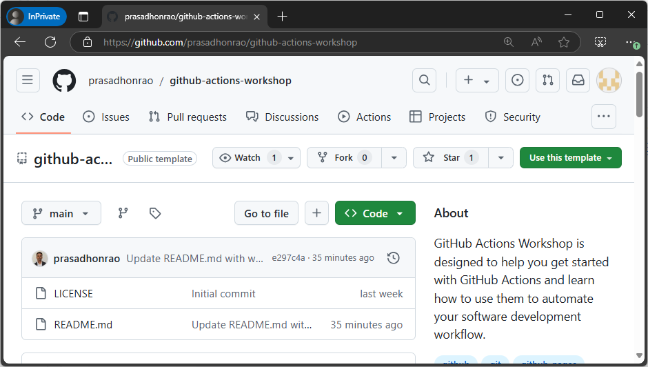
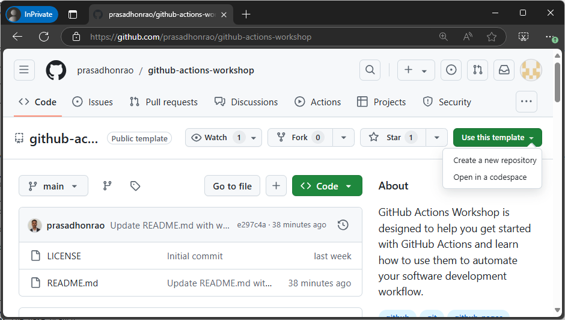
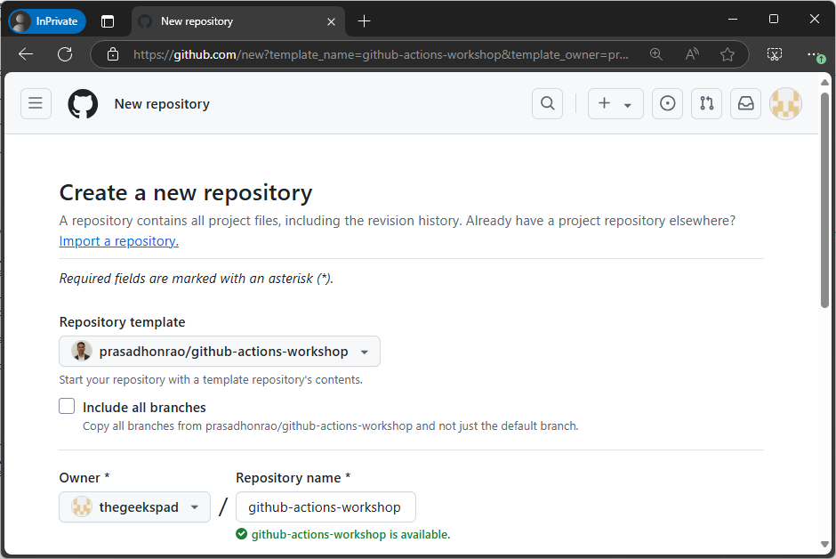
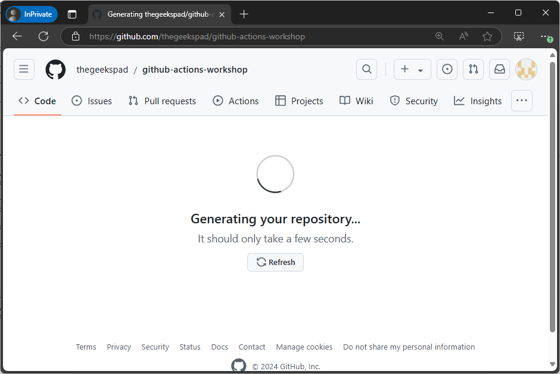
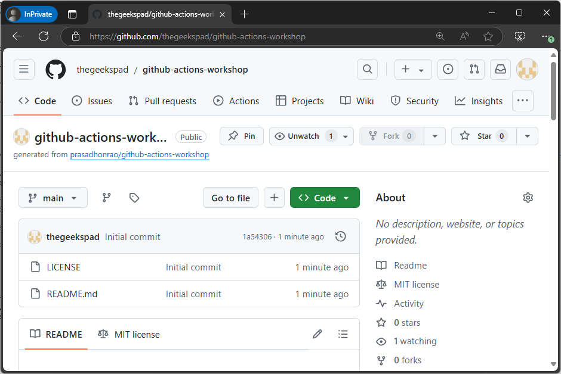

## Lab: Create Repository Using Template Repository

## Introduction

In this lab, you will create a new repository using the `GitHub Actions Workshop` template GitHub repository which contains a set of labs, workflow starter files, solutions and other resources to help you learn GitHub Actions.

> Duration: 10-15 minutes

## Instructions

1. Login to your GitHub account

2. Go to [GitHub Actions Workshop Template Repository](https://github.com/prasadhonrao/github-actions-workshop)

   

3. Click on `Use this template` button and select 'Create a new repository' option.

   

4. Enter the repository name and description

   

5. This will display 'Generating your repository' message

   

6. Once the repository is created, you will see the repository page

   

7. Your repository now contains all the necessary files to get started with GitHub Actions.

8. The `labs` folder contains the markdown files for workflow labs, starter files and solution files.

9. The `src` folder contains the source code for the sample application.

10. The `.github/workflows` folder contains the starter files for the workflows. You can delete these files and create your own workflows as you progress through the workshop.

11. The repository includes utility scripts like `generator.py` and `remove-workflow.sh`. These scripts are used for maintaining the workshop content, such as generating the table of contents for workshop labs in markdown format and deleting all workflows from the `.github/workflows` folder. These are supporting files for repository management and are not required for the workshop. You can safely ignore them during your exercises.

## Summary

Congratulations! You have successfully created a new repository using the GitHub Actions Workshop template. You can now explore the repository and learn more about GitHub Actions.

## Additional Resources

- [Creating a repository from a template](https://docs.github.com/en/github/creating-cloning-and-archiving-repositories/creating-a-repository-from-a-template)
- [GitHub Actions Workshop Template Repository](https://github.com/prasadhonrao/github-actions-workshop)
