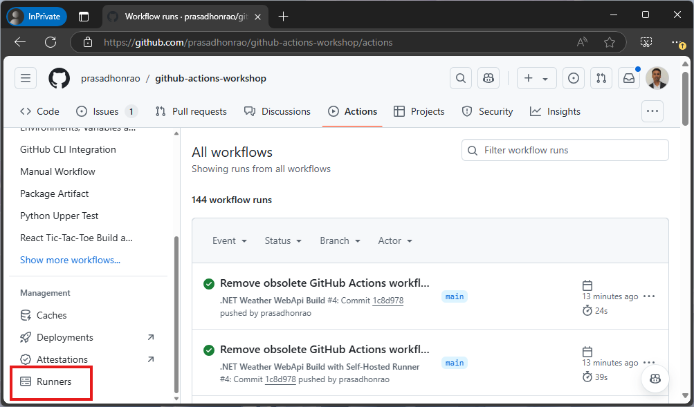
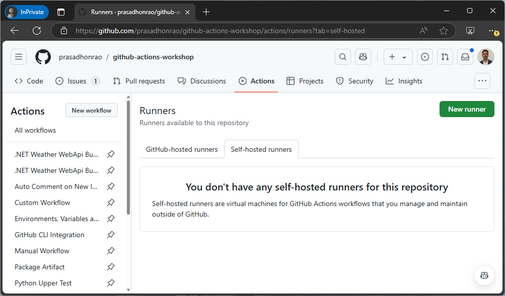
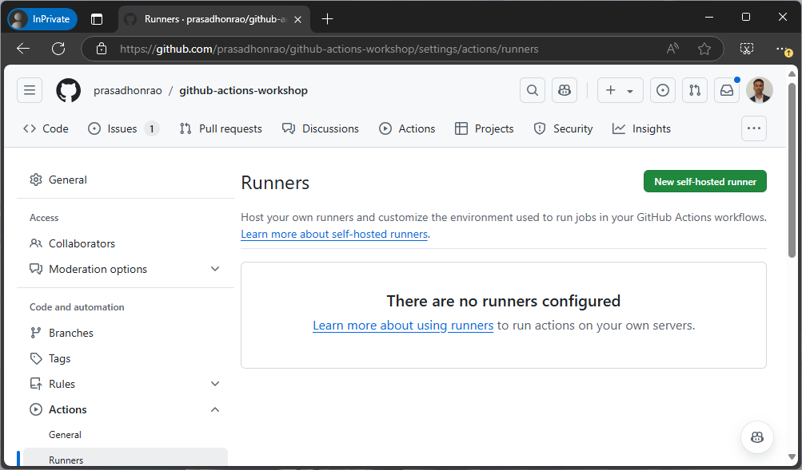
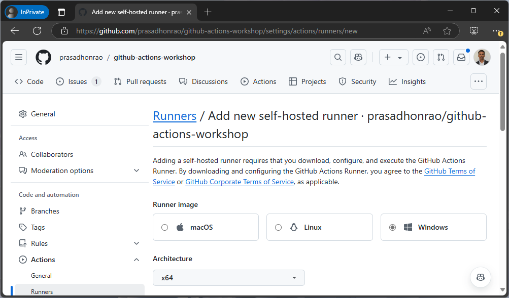
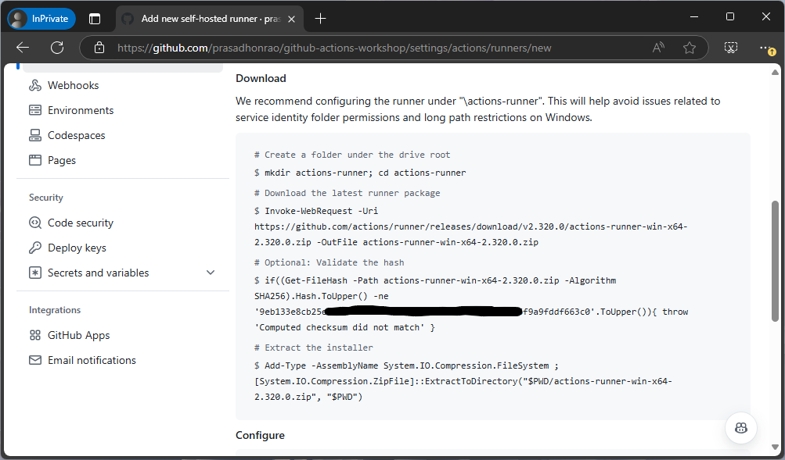
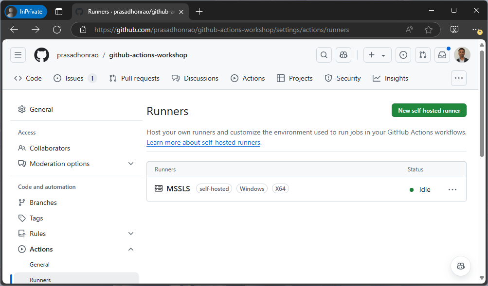

## Lab: Create a Self-Hosted Runner

## Introduction

In this lab, you will learn how to set up a self-hosted runner for your GitHub repository. A self-hosted runner allows you to run GitHub Actions workflows on your infrastructure, giving you more control over the execution environment.

> Duration: 15-20 minutes

---

## Instructions

### Step 1: Navigate to the Repository's Runner Settings

1. Go to your GitHub repository.

   

2. Click on the **"Actions"** tab.

   

3. Click on the **"Runners"** section in the left-hand navigation.

   

---

### Step 2: Add a New Self-Hosted Runner

1. Under the **Self-hosted runners** section, click on the **"Add Runner"** button.

   

2. Click on the **"New self-hosted runner"** button.

   

---

### Step 3: Select Operating System and Architecture

1. On the **"Add a new self-hosted runner"** page, choose the operating system and architecture that matches your machine.
2. Click on the **"Download"** button to download the appropriate runner package.

   

---

### Step 4: Configure the Runner on Your Machine

1. Follow the displayed instructions to configure the runner. This typically involves:

   - Extracting the downloaded package.
   - Running a setup script (e.g., `config.sh` on Linux/MacOS or `config.cmd` on Windows).
   - Adding the runner token provided by GitHub to authenticate.

   

2. Once the setup script completes successfully, start the runner using the provided command (e.g., `./run.sh` or `run.cmd`).

---

### Step 5: Verify the Runner Configuration

1. Return to the **"Runners"** section in the repository’s **Actions** tab.
2. You should see your new self-hosted runner listed as **Online**.

   

---

## Summary

In this lab, you successfully created and configured a self-hosted runner for your GitHub repository. This allows you to execute workflows using your own infrastructure. Self-hosted runners are particularly useful for tasks requiring specific hardware or software configurations.

---

## Additional Resources

- [About self-hosted runners](https://docs.github.com/en/actions/hosting-your-own-runners/about-self-hosted-runners)
- [Configuring self-hosted runners](https://docs.github.com/en/actions/hosting-your-own-runners/configuring-self-hosted-runners)
