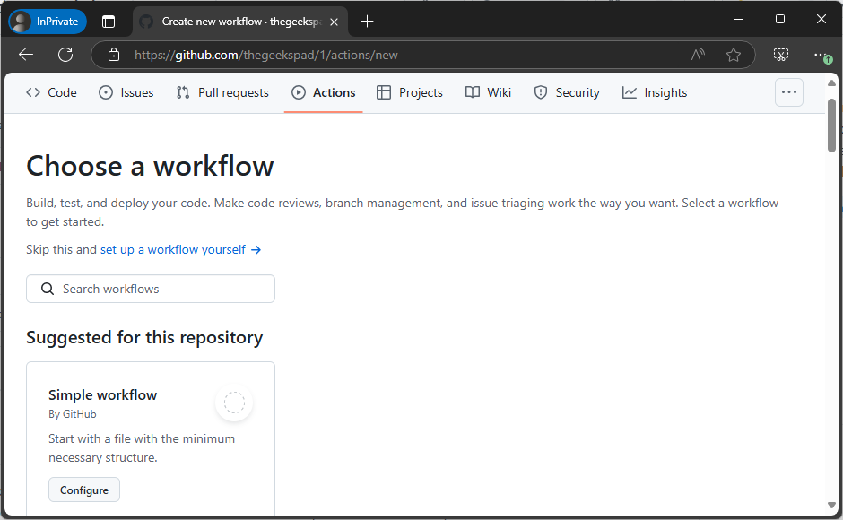
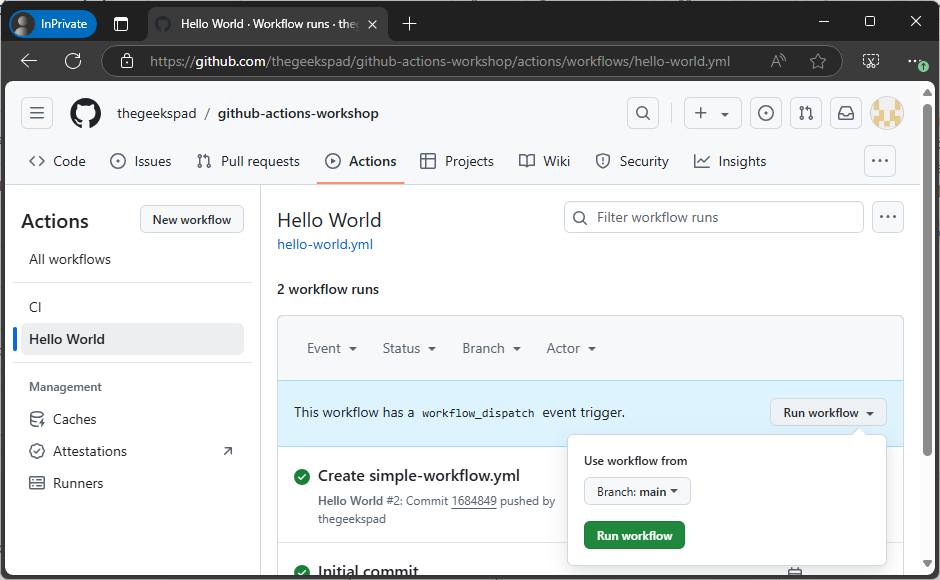
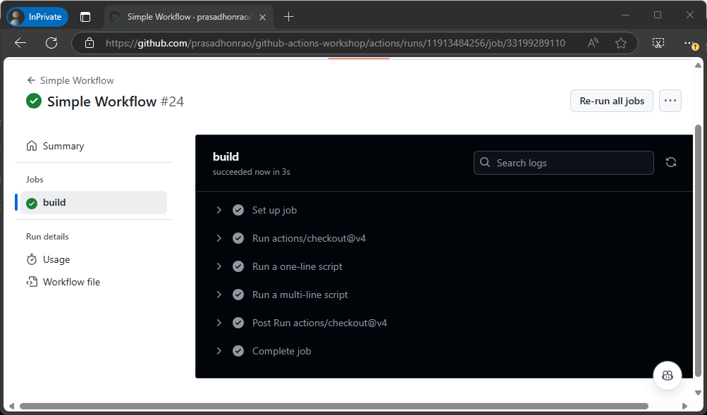

## Lab: Simple Workflow

## Introduction

In this lab, you will use the **Simple Workflow** built-in template to create a GitHub Actions workflow. This workflow is triggered on specific events and demonstrates basic concepts such as jobs, steps, and commands. You will also explore and understand the structure and purpose of the provided workflow file.

> **Duration**: 20-30 minutes

---

## Instructions

### Step 1: Navigate to the Repository

1. Open the repository you created in the previous lab.

   

### Step 2: Open the Actions Tab

1. Click on the **Actions** tab in your repository.

   

### Step 3: Create a New Workflow

1. Click on the **New workflow** button.

   

2. Select the **Simple workflow** template and click **Configure**.

   

### Step 4: Save the Workflow

1. Name the workflow file `simple-workflow.yml`.

2. Click **Commit changes...** to save the workflow.

   

3. This will create the file `.github/workflows/simple-workflow.yml` in your repository.

   

---

#### Understanding the Simple Workflow Template

Here is the content of the **Simple Workflow** template:

```yaml
name: Intro - Simple Workflow

# Controls when the workflow will run
on:
  # Triggers the workflow on push or pull request events but only for the "main" branch
  push:
    branches: ['main']
  pull_request:
    branches: ['main']

  # Allows you to run this workflow manually from the Actions tab
  workflow_dispatch:

# A workflow run is made up of one or more jobs that can run sequentially or in parallel
jobs:
  # This workflow contains a single job called "build"
  build:
    # The type of runner that the job will run on
    runs-on: ubuntu-latest

    # Steps represent a sequence of tasks that will be executed as part of the job
    steps:
      # Checks-out your repository under $GITHUB_WORKSPACE, so your job can access it
      - uses: actions/checkout@v4

      # Runs a single command using the runners shell
      - name: Run a one-line script
        run: echo Hello, world!

      # Runs a set of commands using the runners shell
      - name: Run a multi-line script
        run: |
          echo Add other actions to build,
          echo test, and deploy your project.
```

#### Template Explanation

1. **Name**:  
   The workflow is named **Intro - Simple Workflow** for easy identification.

2. **Triggers** (`on`):

   - **Manual trigger** (`workflow_dispatch`): Allows the workflow to be triggered manually via the Actions tab.
   - **Commented triggers**: Push and pull request triggers for the `main` branch are provided as examples but are commented out. Uncomment them to enable automatic triggers.

3. **Jobs**:  
   The workflow defines a single job named `build`.

4. **Runner**:  
   The job uses the `ubuntu-latest` runner, which provides a Linux environment to execute the workflow steps.

5. **Steps**:
   - **Checkout**: The workflow uses the `actions/checkout@v4` action to clone the repository's code into the runner.
   - **Run commands**:
     - A single-line command prints "Hello, world!" to the console.
     - A multi-line command prints additional lines, demonstrating how to build, test, and deploy a project.

#### Key Takeaways

- This workflow provides a simple foundation to understand the structure of GitHub Actions workflows.
- You can customize it to add more jobs, steps, or triggers as per your project requirements.

---

### Step 5: View and Run the Workflow

1. Return to the **Actions** tab. You should see the workflow listed.

   

2. Click on **Run workflow**, select the `main` branch, and then click **Run workflow**.

   

3. The workflow will begin running. Click on the workflow run to view its details.

   

### Step 6: Inspect the Workflow Run

1. Inside the workflow run details, review the steps executed by the workflow.
2. Expand any steps to view their output.

---

## Summary

In this lab, you used the **Simple Workflow** template to create a workflow. You learned about its structure, including jobs, triggers, and steps, and observed how it operates when triggered manually.

## Additional Resources

- [GitHub Actions Documentation](https://docs.github.com/en/actions)
