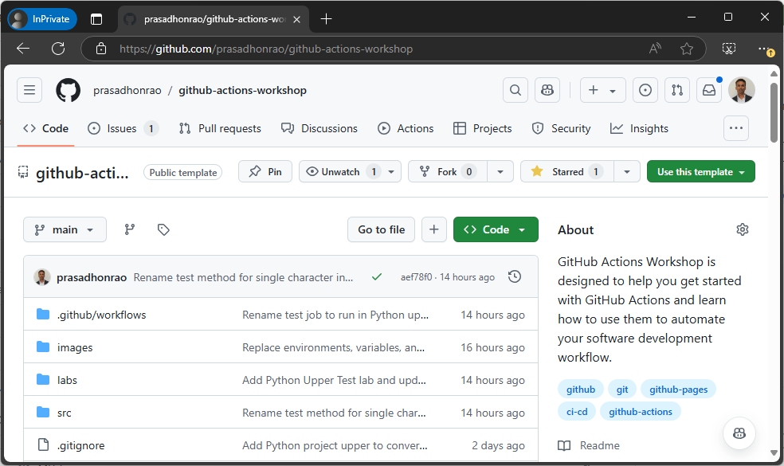
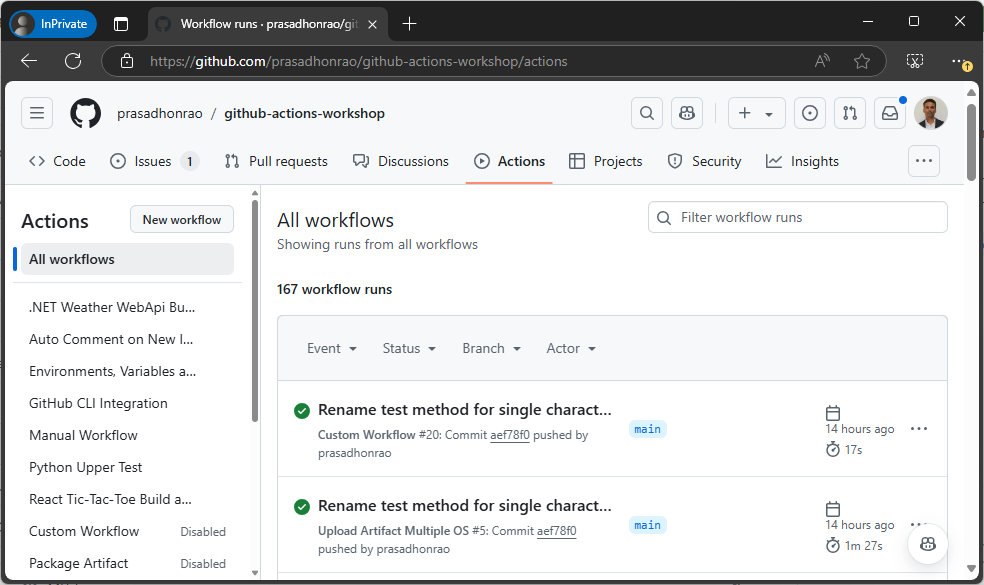
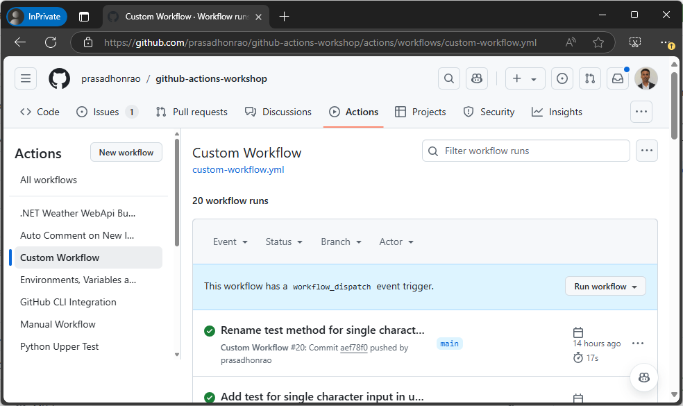
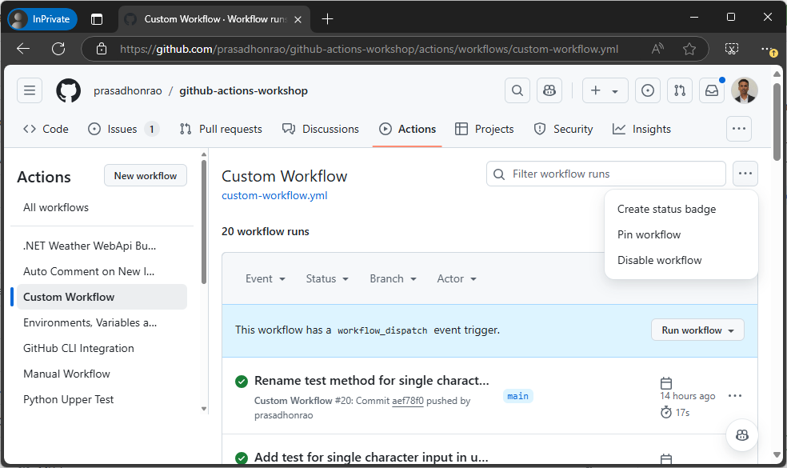
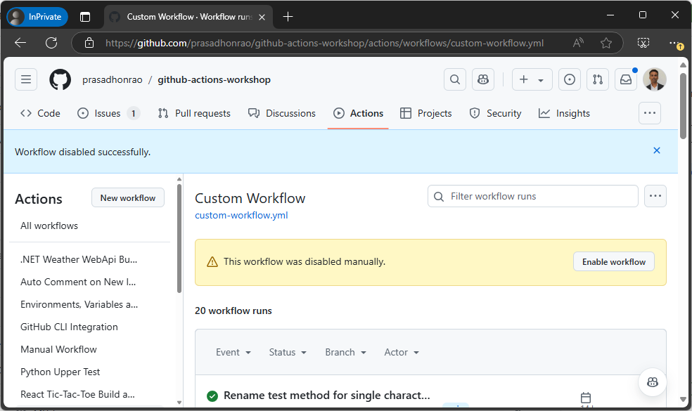
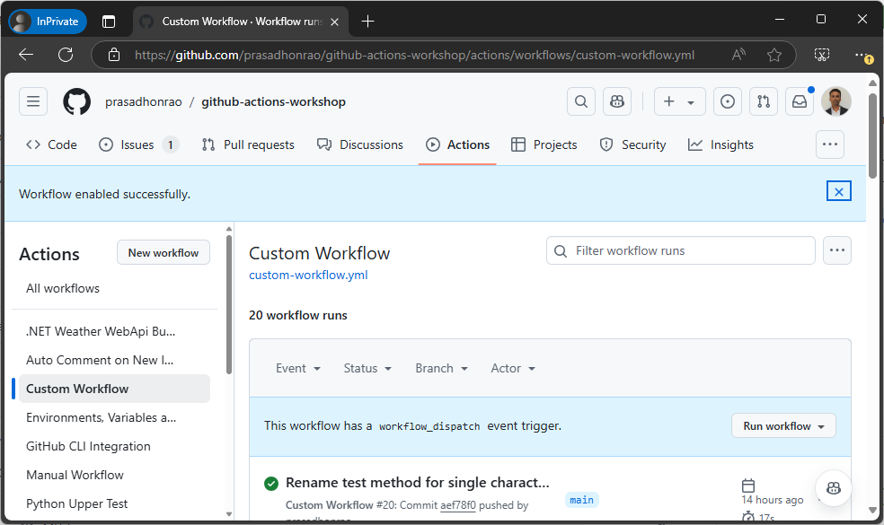

## Lab: Disabling a Workflow

## Introduction

In this lab, you will learn how to disable a workflow in a GitHub repository. This is useful when you want to temporarily stop a workflow from running without deleting the workflow file.

> **Estimated Duration**: 10-15 minutes

---

## Instructions

### Step 1: Navigate to Your GitHub Repository

1. Open your browser and go to your **GitHub repository** where the workflow is located.

   

---

### Step 2: Access the Actions Tab

1. Once in your repository, click on the **Actions** tab at the top of the page.

   

---

### Step 3: Select the Workflow You Want to Disable

1. In the **Actions** tab, you will see a list of workflows that have run in your repository.
2. Click on the workflow you want to disable.

   

---

### Step 4: Disable the Workflow

1. After selecting the workflow, click on the **Ellipsis (three-dot)** icon on the right-hand side of the page.
2. From the dropdown menu, click on **Disable workflow**.

   

---

### Step 5: Confirm the Workflow is Disabled

1. Once the workflow is disabled, you will see a confirmation message indicating that the workflow has been disabled.

   

---

### Step 6: Verify That the Workflow Will Not Run Automatically

1. After disabling the workflow, it will not trigger automatically when the specified events occur.
2. To confirm, try pushing a change or triggering the event the workflow was tied to. You should see that the workflow does not run.

   

---

### Step 7: Re-enable the Workflow (Optional)

1. If you want to re-enable the workflow, click on the workflow name in the **Actions** tab.
2. Then, click on the **Enable workflow** button.

3. You will see a confirmation message indicating that the workflow is now enabled and will run again when the specified events occur.

   

---

## Summary

In this lab, you learned how to disable a workflow in a GitHub repository. This is useful when you want to temporarily stop a workflow from running without deleting the workflow file. You also learned how to re-enable the workflow when needed.

---

## Additional Resources

- [GitHub Actions Documentation](https://docs.github.com/en/actions)
- [Disabling and enabling workflows](https://docs.github.com/en/actions/managing-workflow-runs/disabling-and-enabling-a-workflow)
